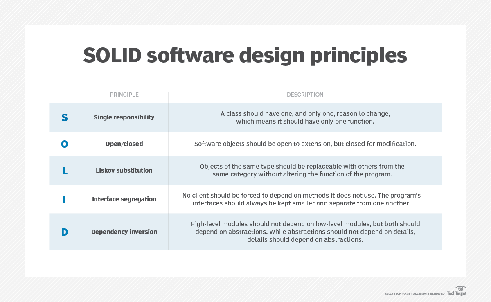

# **Golang Clean Architecture Template**

Over the past several years, the software development community has seen several innovative architectural styles emerge, including microservices and serverless. Each one has its own unique traits, behaviors, technical structure and required expertise. But, overall, they all represent a part of the universal demand for a greater separation of architecture concerns and improved testability.

Clean architecture is yet another one of these architectural styles, though it might be more accurately described as a set of guidelines. Proposed and evangelized by Robert C. Martin, it acts a blueprint for modular systems that strictly adhere to the separation of concerns design principle. The goal of clean architecture is to create layered architectures that are simple, extendable and easy to maintain. [[1]](#Refrences)

Clean architecture has four layers. When working with clean architecture, the dependencies in an application are designed for stability. This means that less-stable components should only depend on components that are more stable. The clean architecture pattern also dictates that the more stable a component is, the more abstract component types it should contain. In the end, code that follows this pattern is decoupled, reusable and easier to maintain. It separates the software elements as following schematic layered ring: 

 

 

## *Domain layer*

- houses the overarching business rules, and logic
- needs that form the foundation for the application's intended role and purpose

- contains what are known as **entities** which
  - represent the *class* and *interface* **types** needed by the enterprise business rules. These types 
    - encapsulate the most general and high-level rules that the application would take advantage of.
    - do not have any knowledge of the other layers.
    - do not have any dependency on any other types of components residing in the outer layers

## *Application layer*

- contains the rules and logic that relate specifically to the application's design and behavior.
- includes **use cases** which
  - refer to the specific business rules that define the application's responsibilities and expected behavior.
- isolated from external elements, such as 
  - the user interface
  - database
  - frameworks 

## *Adapter layer*

- holds APIs and gateways, which
  - govern the flow of communication between the application's back end and the external components. 
- responsible for outward facing elements such as
  - the application presenters
  - views
  - controllers   

In clean architecture, none of these external components should have any knowledge of or dependence on the data persisted in the database.

## *Infrastructure layer*

- serves up all necessary details pertaining to the particular web frameworks or database models in use.
- These details should be abstracted from the **domain layer**, since
  - teams will need to alter the configuration of these frameworks and databases over time.
  - teams can update and modify an application's code structure, data models and user interface without impacting the foundational domain layer. 

## **5 steps to clean architecture**

To get started implementing clean architecture, follow the points given below:

1. Split your application's code into layers.
2. Place abstractions in the inner layers.
3. Put implementation in the outer layers.
4. Point dependencies inwards.
5. Follow test-driven development outside-in.

## **The 8 principles of clean architecture**

1. **Dependency rule**
> 
> The essence of the dependency rule rests in controlling the flow of application dependencies. While any one of the layers in a clean architecture can encapsulate a dependency, those dependencies can only point inward, as the inner layers are designed not to have any knowledge of the outer layers. For example, while the adapter layer can retain a dependency with an application layer component, the application layer cannot be dependent on anything within the adapter layer.
> 
2. **Abstraction principle**
> 
> The abstraction principle states that the *business rules* and *application layers* should contain business rules/business logic, with the innermost circle being the most abstract. Meanwhile, the *adapter* and *infrastructure* layers should contain implementation details, with the outermost circle being the most concrete.
> 
3. **SOLID**
>
> 

 
>
4. **Reuse/release equivalence principle (REP)**
>
> REP states that a release should never contain collections of unrelated classes. Instead, any class or module released should be reusable as a cohesive unit and tracked through a well-defined release process.
> 
5. **Common closure principle (CCP)**
>
>CCP demands that application components should contain collections of shared classes, and that the classes in each collection should always change at the same time for the same reason. The term "common closure" implies that classes that change for the same reason should exist in a closed set.
> 
6. **Common reuse principle (CRP)**
>
> This principle states that the classes in a component should be reused together -- if you reuse one of them, you reuse them all. This is similar to the interface segregation principle found in SOLID, in that it prevents classes from containing methods it doesn't use.
>
7. **Acyclic dependency principle (ADP)**
>
> If multiple components have a feedback loop of dependencies, you have what is known as a dependency cycle. It is difficult to make changes when this is the case, so ADP dictates that there should not be any dependency cycles in an application. The solution to breaking these cycles is using dependency injection.
>
8. **Ports and adapters**
>
> Ports are the interfaces exposed by the application, while adapters slot those interfaces. While ports are independent of any technology, adapters are technology-specific, allowing them to manage the specific adjustments needed for a particular type of component. Clean architecture takes advantage of the ports and adapters pattern, also known as the hexagonal architecture pattern, to implement a separation of concerns, as neither the application nor the port need understand the technology-specific details handled by the adapter.
>

A project that follows the clean architecture principles will be: [[2]](#refrences)

1. **UI independent**: changing the UI should not affect other parts of the projects.
2. **Framework independent**: it doesn’t matter what library you’re using. frameworks will be used as tools and will not force any business rules.
3. **Database independent**: the project shouldn’t care or depend on the chosen database. moreover, we would want to choose our database as late as possible in order to maintain flexibility
4. **Testable**: a system that is testable is a system that you have confidence working with — therefor it’s a system that is easy to extend or maintain.
5. **strict on it’s dependency rules**: source code dependencies can only point INWARDS, meaning that an inner circle will know nothing about an outer circle.

# **Refrences**
1. https://www.techtarget.com/searchapparchitecture/tip/A-primer-on-the-clean-architecture-pattern-and-its-principles
2. https://itnext.io/golang-and-clean-architecture-19ae9aae5683